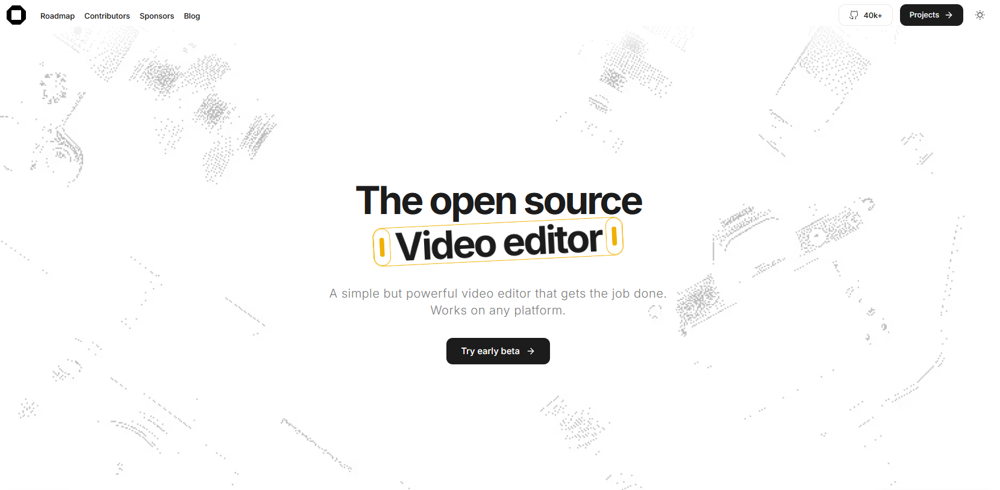
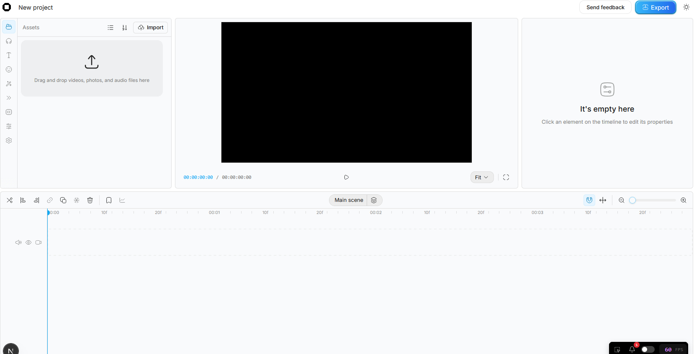

<div align="center">

# 🎬 OpenCut Simplified

### A stable, self-hosted fork of OpenCut — the free & open-source CapCut alternative

[](LICENSE)
[](https://bun.sh)
[](https://www.docker.com/)
[](https://nextjs.org/)
[](#)

**Fully working • Docker build bugs fixed • One-command startup • Beginner-friendly setup guide**

</div>

---

## 📖 Table of Contents

- [About this fork](#-about-this-fork)
- [Why this fork exists](#-why-this-fork-exists)
- [Screenshots](#-screenshots)
- [Prerequisites](#-prerequisites)
- [Installation — step by step](#-installation--step-by-step)
- [Environment variables](#-environment-variables)
- [One-command startup](#-one-command-startup)
- [Known bugs fixed in this fork](#-known-bugs-fixed-in-this-fork)
- [Troubleshooting](#-troubleshooting)
- [Project structure](#-project-structure)
- [License](#-license)
- [Credits](#-credits)

---

## 🧩 About this fork

**OpenCut Simplified** is a self-hosted, debugged version of [OpenCut](https://github.com/OpenCut-app/OpenCut) — a free, open-source, privacy-first video editor that runs entirely in your browser, positioned as a direct alternative to **CapCut Pro** (no watermark, no subscription, no cloud upload).

This fork exists because the upstream `main` branch is undergoing a full architectural rewrite (migration to a Rust/WASM core via a `moon`/`proto` toolchain) and regularly breaks when building locally. This repository documents every build issue encountered and fixes needed to get a **fully working local instance** on Windows via WSL2.

---

## ❓ Why this fork exists

> [!IMPORTANT]
> The official `OpenCut-app/OpenCut` repository is mid-rewrite. Cloning it directly and running `bun run build` or `docker compose up` will very likely fail with TypeScript compilation errors or hang indefinitely.

This fork starts from a working checkout and applies the following corrections:

| Problem | Root cause | Fix |
|---|---|---|
| TypeScript build fails (`isShortcutKey` not exported) | Function renamed during rewrite, old import left behind | Aliased import |
| TypeScript build fails (`isActionWithOptionalArgs` not exported) | Same as above | Aliased import to the real exported function |
| `bun install` hangs forever inside Docker (`Resolving dependencies`) | Known bug in `oven/bun:alpine` image (musl libc) | Run Bun locally, use Docker only for DB/Redis |
| `Failed to fetch: 401` on Sound Effects panel | Placeholder Freesound API keys | Real API credentials required (see below) |
| `git push` rejected (`non-fast-forward`) | Detached HEAD after tag checkout | Proper branch creation workflow documented |

---

## 🖼 Screenshots

<div align="center">

| Landing page | Editor — new project |
|:---:|:---:|
|  |  |

</div>

---

## ✅ Prerequisites

| Tool | Purpose | Install command |
|---|---|---|
| **Git** | Version control | `sudo apt install git` |
| **Bun** | JS runtime & package manager | `curl -fsSL https://bun.sh/install \| bash` |
| **Docker Desktop** | Runs PostgreSQL + Redis locally | [docker.com](https://www.docker.com/products/docker-desktop/) (enable WSL2 integration) |
| **Freesound account** | Required for sound effects API | [freesound.org](https://freesound.org) (free) |

---

## 🚀 Installation — step by step

### 1️⃣ Clone the repository

```bash
git clone https://github.com/jamesdoe6/opencut-simplified.git
cd opencut-simplified
```

### 2️⃣ Configure environment variables

```bash
cp .env.example apps/web/.env.local
```

Fill in the values as described in the [Environment variables](#-environment-variables) section below.

### 3️⃣ Start the supporting services (PostgreSQL + Redis) via Docker

```bash
docker compose up -d db redis serverless-redis-http
```

> [!WARNING]
> Do **not** run a plain `docker compose up -d` to build the whole app inside Docker. The `oven/bun:alpine` base image has a confirmed bug causing `bun install` to hang indefinitely. Always run the app itself with Bun locally (next step).

### 4️⃣ Install dependencies

```bash
bun install
```

### 5️⃣ Run the app

```bash
bun dev:web
```

### 6️⃣ Open the editor

Go to **[http://localhost:3000](http://localhost:3000)**, click **"Try early beta" → "New Project"**, and start editing.

---

## 🔑 Environment variables

| Variable | Required? | Description | Where to get it |
|---|:---:|---|---|
| `DATABASE_URL` | ✅ Yes | PostgreSQL connection string | Default works with local Docker |
| `UPSTASH_REDIS_REST_URL` / `TOKEN` | ✅ Yes | Redis cache connection | Default works with local Docker |
| `BETTER_AUTH_SECRET` | ✅ Yes | Auth session encryption key | Generate: `openssl rand -base64 32` |
| `FREESOUND_CLIENT_ID` / `FREESOUND_API_KEY` | ✅ Yes | Sound effects search (else 401 error) | [freesound.org/apiv2/apply](https://freesound.org/apiv2/apply/) |
| `MARBLE_WORKSPACE_KEY` | ⬜ Optional | Blog/changelog CMS only | Not needed for editor use |

---

## ⚡ One-command startup

A convenience script is included in `package.json` to avoid running Docker and Bun separately every time:

```bash
bun run start:all
```

This automatically:
1. Starts the database + Redis containers in the background
2. Launches the Next.js dev server

Stop everything with:
```bash
docker compose down
```
(and `Ctrl+C` in the terminal running `bun dev:web`)

---

## 🐛 Known bugs fixed in this fork

<details>
<summary><strong>Click to expand full bug list & fixes</strong></summary>

<br>

**1. `isShortcutKey` not exported**
📁 `apps/web/src/actions/keybindings/persistence.ts`
```diff
- import { isShortcutKey } from "@/actions/keybinding";
+ import { isKey as isShortcutKey } from "@/actions/keybinding";
```

**2. `isActionWithOptionalArgs` not exported**
📁 Same file — verify the real exported name with:
```bash
grep -n "^export function is\|^export const is" apps/web/src/actions/index.ts
```

**3. Docker build hangs on "Resolving dependencies"**
Root cause: `oven/bun:alpine` image bug with dependency resolution.
Fix: build/run with Bun **locally**, use Docker only for `db`, `redis`, `serverless-redis-http`.

**4. 401 error on Sound Effects panel**
Root cause: placeholder Freesound credentials.
Fix: request real API keys at [freesound.org/apiv2/apply](https://freesound.org/apiv2/apply/).

</details>

---

## 🛠 Troubleshooting

| Symptom | Likely cause | Fix |
|---|---|---|
| `bun install` hangs in Docker | Alpine image bug | Run `bun install` locally instead |
| `Cannot connect to the Docker daemon` | Invalid `/etc/docker/daemon.json` (malformed JSON) | Validate JSON syntax, `sudo systemctl restart docker` |
| `git push` → `non-fast-forward` | Local/remote history diverged | `git push origin main --force` (only on your own fork) |
| `Failed to fetch: 401` in Sounds panel | Placeholder Freesound keys | Add real keys to `.env.local` |
| Port 3000 already in use | Another process running | `PORT=3001 bun dev:web` |

---

## 📂 Project structure

```
opencut-simplified/
├── apps/
│   ├── web/          # Next.js frontend (main editor)
│   └── desktop/       # Desktop app shell
├── rust/              # WASM compositor core
├── docs/
│   └── screenshots/   # README images
├── docker-compose.yml # DB + Redis services
├── package.json       # Includes custom start:all script
└── README.md
```

---

## 📜 License

Distributed under the **MIT License** — same as the original OpenCut project.
See [`LICENSE`](LICENSE) for full text.

---

## 🙏 Credits

Based on [OpenCut-app/OpenCut](https://github.com/OpenCut-app/OpenCut), built by the OpenCut open-source community.
This fork only adds build fixes, local self-hosting documentation, and quality-of-life scripts.

<div align="center">

**⭐ If this fork saved you hours of debugging, consider starring it!**

</div>